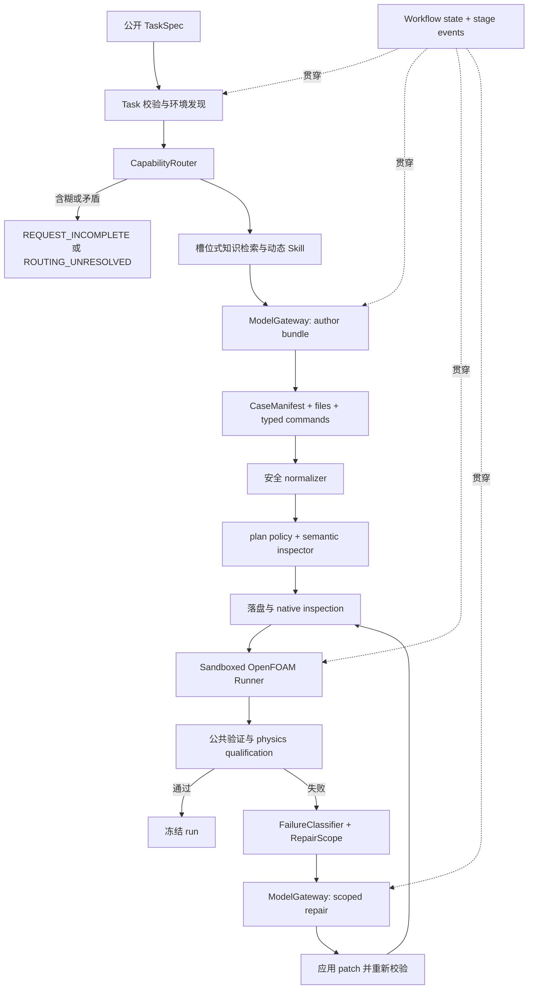

# FoamPilot 架构优化设计规格

状态：阶段 A 已实施并通过 gate；阶段 B–D 尚未实施
日期：2026-07-30
适用基线：FoamPilot `8d30409`
设计主题：运行韧性、薄语义层、定向修复与受控学习路由
架构定位：Qualification-first Transition Architecture（FoamPilot 健康架构 v1）

相关证据：

- [当前架构](architecture.md)
- [单算例工作流与求解前健康度分析](runtime-workflow-and-pre-solve-health-analysis.md)
- [新增 10 个官方场景复测与受控学习报告](reports/2026-07-30-extended-10-learning.md)
- [阶段 A 验收记录](reports/2026-07-31-stage-a-acceptance.md)

实施边界：

- 已完成：A0 冻结 replay、A1 单次 Provider Client、A2
  ModelGateway、A3 qualification 共享 breaker 与分层指标、A4
  WorkflowStore、A5 RunSummary v2、A6 strict continuation、A7
  确定性/真实最小 gate；
- 尚未开始：CapabilityRouter、slot-based context、region-aware
  CaseManifest、semantic inspector、scoped RepairPatch 和学习目标路由。

因此本文仍是完整的 v1 设计依据，但只有阶段 A 的条款代表当前代码能力。

## 1. 背景与结论

FoamPilot 当前已经形成以下真实闭环：

```text
公开 TaskSpec
→ 动态公开知识
→ 模型编写完整 OpenFOAM case
→ 安全检查
→ OpenFOAM 执行
→ 独立评测
→ 一次受限修复
→ 不可变产物
```

Runner、typed command、bubblewrap、评测隔离、不可变 attempt 和防泄漏
边界应继续保留。当前主要结构问题不是 OpenFOAM 工具能力不足，而是：

1. 远端模型服务同步位于每题关键路径，缺少错误分类、批次熔断、阶段
   deadline、checkpoint 和 resume；
2. 模型同时承担物理决策、solver 选择、跨文件依赖、OpenFOAM 语法和
   原始文件生成，确定性系统只校验安全与少量机械错误；
3. canonical 上下文在 solver-family 路由前执行统一 top-N 检索，并固定
   注入一份通用 Skill；
4. repair 输出范围受限，但输入仍包含完整 plan 和全部声明文件；
5. 一个终态字符串无法同时表达原始 CFD 失败和随后出现的 provider
   阻塞；
6. 离线学习框架尚不能把 provider、router、orchestrator 和 family
   contract 识别为独立改进目标。

本设计采用以下路线：

> 先修运行韧性，再增加不负责渲染文件的薄语义层，最后只把经题库证据
> 反复证明稳定的规则下沉为确定性 solver-family contract。

本设计不把 FoamPilot 改造成通用 OpenFOAM renderer。正式盲测中，完整
case 仍由 Agent 编写。

## 2. 设计目标

### 2.1 必须实现

1. provider 过载、限流、鉴权和网络错误得到不同处理；
2. 批量任务不会在已知 provider 过载时让每题重复完整重试；
3. generation 或 repair 中断后可以从冻结证据创建 continuation run；
4. 原始 CFD 失败不会被后续 provider 阻塞覆盖；
5. 在生成前形成轻量 `CapabilityProfile`，再按知识槽位组装上下文；
6. 通用 Skill 之外最多动态加载一个适用的 family Skill；
7. 模型在同一次 case-bundle 响应中返回薄型 `CaseManifest`；
8. 确定性检查只阻断高置信度的跨文件矛盾；
9. repair 只接收与失败相关的文件、日志和知识，并能安全插入缺失命令；
10. 学习候选能够路由到正确的架构层，而不是全部进入知识或 Skill。

### 2.2 质量属性

- **简单**：不增加逐文件模型 reviewer，不建立多智能体图；
- **可恢复**：远端故障不使已完成的本地阶段失效；
- **可审计**：所有路由、请求、重试、状态和 continuation 都有结构化
  证据；
- **低耦合**：Provider Gateway、语义检查和 Runner 可以独立测试；
- **防泄漏**：目标 tutorial、private evaluator 和 golden 继续与
  authoring、routing、repair 隔离；
- **可演进**：仅在真实失败证据支持时增加 family contract；
- **不降格盲测**：qualification 继续衡量 Agent 独立编写原生 case 的
  能力。

## 3. 非目标

本轮架构优化明确不包括：

- MCP；
- 多智能体协同；
- LangGraph；
- FAISS 或大型 embedding RAG；
- 逐文件生成和逐文件 reviewer；
- 每道算例一个 renderer、模板或 Python adapter；
- 完整 OpenFOAM 字典解释器；
- 一次覆盖所有 solver family 的万能 CaseIR/compiler；
- OpenFOAM-13 或 ESI 版本兼容；
- CAD、Gmsh、snappyHexMesh 或 HPC 平台的通用编排；
- 正式盲测中的自动 provider fallback；
- Agent 自动修改并推广自身代码、知识或 Skill；
- 把自然语言产品入口与本轮运行时重构同时实施。

## 4. 核心设计原则

### 4.1 Agent 仍然编写完整 case

`CaseManifest` 只表达高层决策和跨文件声明，不生成 `controlDict`、
`fvSchemes`、`fvSolution`、字段或网格字典。

```text
LLM
= 需求理解
+ solver/模型/网格决策
+ CaseManifest
+ 完整原生 case 文件
+ typed commands
+ 异常情况下的受约束修复

确定性系统
= provider 治理
+ 路由和上下文组装
+ 高置信度一致性检查
+ 安全正规化
+ 执行
+ 评测
+ checkpoint/resume
```

为避免把当前 authoring 策略固化为永久事实，case authoring 使用一个
稳定扩展点：

```python
class CaseAuthoringBackend(Protocol):
    def author(
        self,
        task: TaskSpec,
        capability: CapabilityProfile,
        context: AgentContext,
    ) -> ExecutionPlan: ...
```

首期只有 `AgentNativeCaseAuthor`，仍由模型返回 manifest、完整文件和
typed commands。未来 engineering policy 可以另行实现
`FamilyCompilerAuthor` 或 `HybridCaseAuthor`，但它们不属于本规格的
实施范围，也不得进入当前 qualification protocol。

### 4.2 运行可靠性与 CFD 正确率分开统计

系统必须分别报告：

```text
P(端到端完成)

P(目标 solver 启动 | 取得有效 case bundle)

P(公开验证通过 | 目标 solver 已启动)

P(物理 qualification 通过 | 公开验证通过)
```

provider 故障不计为 CFD case 错误，但必须计入端到端可靠性。

### 4.3 不用提示词代替确定性工具

无歧义、可安全证明的规则进入 normalizer、inspector 或 evaluator。
依赖工程判断的内容保留给模型。无法确定的语义产生 warning 或
`ROUTING_UNRESOLVED`，不得被硬编码为阻断规则。

### 4.4 冻结证据与恢复工作流分离

旧 run 永不修改。恢复通过创建新的 continuation run 完成，并记录
parent run、parent manifest hash 和恢复阶段。

### 4.5 不保留两套长期主流程

新组件启用后，canonical solve 路径直接迁移。只允许为历史产物保留一个
只读 summary adapter；不保留旧 generation、repair 或 execution 分支。

## 5. 目标数据流



两个横向组件贯穿全部阶段：

- `ModelGateway`：provider 错误、预算、重试、熔断和请求证据；
- `WorkflowStore`：阶段事件、checkpoint、失败记录、continuation 和
  artifact lineage。

## 6. ModelGateway

### 6.1 边界

CLI、NativeAgent 和 qualification runner 不再直接构造或调用
`CodexOAuthModelClient`。它们只依赖：

```python
class ModelGateway(Protocol):
    def generate_structured(
        self,
        request: ModelRequest,
        schema: type[T],
        budget: ModelBudget,
        trace: ModelTraceSink,
    ) -> ModelResult[T]: ...
```

当前 `CodexOAuthModelClient.generate_structured()` 已经只发起一次
HTTP/SSE 请求；重试位于外层 `generate_with_retry()`。阶段 A 不是从
client 中搬走重试，而是冻结并强化以下边界：

```python
class ProviderClient(Protocol):
    def exchange(
        self,
        request: ModelRequest,
        *,
        timeout_seconds: float,
    ) -> ProviderResponse: ...
```

`ProviderResponse` 保存完整 output text、HTTP/SSE 元数据和 provider
request ID。provider client 只负责一次交换和 provider-specific 事件
解析；它不重试、不熔断、不决定阶段 deadline，也不执行最终 Pydantic
schema 校验。重试、deadline、熔断、trace 和 schema validation 统一由
gateway 负责。

### 6.2 错误分类

```text
PROVIDER_OVERLOADED
PROVIDER_RATE_LIMITED
PROVIDER_AUTH_FAILED
PROVIDER_PERMISSION_DENIED
PROVIDER_NETWORK_UNAVAILABLE
PROVIDER_STREAM_INTERRUPTED
PROVIDER_SCHEMA_INVALID
PROVIDER_UNKNOWN
```

每个错误至少包含：

- provider 和 model；
- request purpose；
- provider error code；
- retryable；
- HTTP status（若存在）；
- server request ID（若存在）；
- `Retry-After`（若存在）；
- 是否收到部分响应；
- 安全脱敏后的 detail。

### 6.3 默认重试策略

| 错误 | 默认行为 |
| --- | --- |
| overload | 最多 3 次传输尝试，退避 5、15 秒 |
| rate limit | 优先采用 `Retry-After`，但不得超过阶段 deadline |
| network unavailable | 最多 3 次传输尝试，退避 5、15 秒 |
| stream interrupted | 没有完整结构化结果时最多重试 1 次 |
| auth failed | 不重试 |
| permission denied | 不重试 |
| schema invalid | 不按 transport 重试 |

默认 budget：

```yaml
request_timeout_seconds: 300
generation_deadline_seconds: 360
repair_deadline_seconds: 240
total_model_deadline_seconds: 600
max_transport_attempts: 3
```

这些 budget 独立于 OpenFOAM command 的 `max_wall_seconds`。

### 6.4 Deadline 计算语义

所有 deadline 使用单调时钟。逻辑请求开始时记录绝对 stage deadline，
每次传输的 timeout 计算为：

```text
attempt_timeout
= min(request_timeout_seconds, stage_remaining_seconds,
      total_model_remaining_seconds)
```

必须满足：

1. backoff 计入 stage 和 total model deadline；
2. `Retry-After` 计入 deadline，且不得突破剩余时间；
3. 剩余时间不足以启动下一次传输时直接停止，不再发送请求；
4. request timeout 或 stage deadline 到达后必须关闭 SSE response；
5. trace 明确记录 `REQUEST_TIMEOUT`、`STAGE_DEADLINE` 或
   `TOTAL_MODEL_DEADLINE`；
6. wall clock 只用于可读时间戳，不参与预算计算。

### 6.5 共享熔断器

熔断键：

```text
provider + model + account identity
```

同一键连续两次完整逻辑请求最终以 overload 或 network unavailable
结束时，熔断器打开 120 秒。

- 打开期间，后续 qualification task 不发送 HTTP 请求；
- task 进入 `DEFERRED_PROVIDER`；
- cooldown 后允许一个 half-open 探测请求；
- 成功则关闭，失败则重新打开；
- 单题 `solve` 也读取熔断状态，但不与其他进程共享磁盘全局状态；
- qualification runner 内的所有 worker 必须共享同一个 gateway 实例。

正式 qualification 禁止自动切换 provider 或 model，以免改变实验变量。
未来 engineering policy 可以显式允许 fallback，但必须记录到结果中。

### 6.6 请求 trace

每次真实传输尝试记录：

```yaml
purpose:
provider:
model:
request_hash:
logical_request_id:
transport_attempt:
started_at:
finished_at:
prompt_bytes:
output_bytes:
http_status:
provider_request_id:
provider_error_code:
retryable:
partial_output_bytes:
```

trace 不保存 access token，也不默认保存完整 prompt 或 provider 原始响应。
逻辑 `model_calls` 和真实 `transport_attempts` 分开统计。

## 7. WorkflowStore 与状态模型

### 7.1 阶段

```text
TASK_VALIDATED
ENVIRONMENT_READY
ROUTING_READY
CONTEXT_READY
MODEL_GENERATION_STARTED
PLAN_READY
CASE_MATERIALIZED
STATIC_INSPECTION_COMPLETE
OPENFOAM_STEP_STARTED
OPENFOAM_STEP_COMPLETE
PUBLIC_VALIDATION_COMPLETE
REPAIR_SCOPE_READY
MODEL_REPAIR_STARTED
REPAIR_APPLIED
RUN_FINALIZED
```

所有模式都将事件写入 `workflow-events.jsonl`。非 JSON 模式另外实时
打印简洁阶段事件；JSON 模式在命令结束时仍只向标准输出写一个结果
对象，避免破坏机器解析。

### 7.2 RunSummary v2

```yaml
schema_version: 2
task_id:
workflow_state: COMPLETED | FAILED | DEFERRED
native_status: null | STATIC_INSPECTION_FAILED | MESH_FAILED
  | INITIALIZATION_FAILED | SOLVER_FAILED | POSTPROCESS_FAILED
  | PUBLIC_VALIDATION_FAILED | PUBLIC_VALIDATION_PASS
last_completed_stage:
attempts: []
primary_failure:  # null or FailureRecord
  domain:
  code:
  step_id:
  retryable:
  detail:
  evidence_paths: []
terminal_blocker:  # null or FailureRecord
  domain:
  code:
  retryable:
  detail:
resume:
  allowed:
  from_stage:
parent_run:
  run_id:
  manifest_sha256:
message:
```

`primary_failure` 表示任务首先暴露的 CFD、plan、mesh、solver 或 validation
问题。`terminal_blocker` 表示当前为什么不能继续。
generation 尚未形成有效 native attempt 时，`native_status` 必须为
`null`；provider、routing 或 workflow failure 不得伪装成 CFD native
status。`REQUEST_INCOMPLETE`、`PLAN_INVALID` 和
`CASE_GENERATION_FAILED` 由 `primary_failure.domain/code` 表达，也不再
占用 native status。

若 generation 开始前首次发生 provider 故障，`primary_failure` 可以为
`null`，provider 记录在 `terminal_blocker`。若任务因不可重试的 task、
routing 或 plan 错误结束，则该错误进入 `primary_failure`，
`terminal_blocker` 可以为 `null`。

示例：

```yaml
workflow_state: DEFERRED
native_status: SOLVER_FAILED
primary_failure:
  domain: solver
  code: missing_dictionary_keyword
  step_id: solve
terminal_blocker:
  domain: provider
  code: PROVIDER_OVERLOADED
  retryable: true
resume:
  allowed: true
  from_stage: MODEL_REPAIR_STARTED
```

### 7.3 Continuation run

新增：

```bash
foampilot resume PARENT_RUN --run-root RUN_ROOT --json
```

恢复规则：

1. 验证 parent artifact manifest；
2. 只允许恢复 gateway 标记为 retryable 的 generation 或 repair 阶段；
3. 创建新的 run，不修改 parent；
4. 写入 parent run ID 和 manifest SHA256；
5. generation 未完成时重新执行完整 generation；
6. repair 未完成时复用 parent 的 active plan、公开报告和失败证据；
7. 在 child 中重新物化 case 并重新执行，不直接修改 parent case；
8. v1 历史 run 只读可报告，不支持 resume。

SSE 部分响应只作为诊断证据，不直接拼接为后续 JSON。

### 7.4 Lineage 累计预算

continuation 可以获得新的 stage deadline，但不能形成无界重试。默认：

```yaml
resume_policy:
  max_continuations_per_stage: 2
  stage_budget_resets_on_resume: true
  lineage_transport_attempt_limit: 7
```

规则：

1. generation 和 repair 分别最多创建两个 continuation；
2. child 获得新的 generation 或 repair stage deadline；
3. parent 与所有 child 的真实 transport attempts 累计不得超过 7；
4. 达到任一上限时 `resume.allowed=false`；
5. qualification report 汇总整个 lineage 的模型时间、逻辑请求和真实
   transport attempts；
6. 用户主动修改代码、知识、Skill 或模型策略后发起的是
   `rerun_with_changes`，不消耗原 lineage resume budget，也不得标记为
   strict resume。

### 7.5 Resume compatibility fingerprint

parent 除 manifest 外还必须冻结：

```yaml
resume_compatibility:
  task_sha256:
  public_assets_sha256:
  model:
  provider:
  provider_policy_sha256:
  package_version:
  package_artifact_sha256:
  git_revision:  # nullable outside a Git checkout
  execution_plan_schema:
  knowledge_ids: []
  knowledge_hash:
  skill_ids: []
  skill_hash:
  openfoam_target:
```

resume 前重新执行环境发现并比较 fingerprint：

- TaskSpec、public asset、OpenFOAM target 或 ExecutionPlan schema
  改变：拒绝 strict resume；
- model、provider policy、知识、Skill、package artifact 或 source revision
  改变：拒绝 strict resume，提示使用 `rerun_with_changes`；
- 主机路径变化但 OpenFOAM distribution/version、所需 executable 和公开
  资产保持兼容：允许 resume，并记录 environment warning；
- executable 缺失或 OpenFOAM 版本变化：拒绝 resume。

## 8. CapabilityRouter

### 8.1 目标

在检索知识和加载 family Skill 前形成一个轻量、可审计的能力分类：

```yaml
schema_version: 1
physics_family:
regime: steady | transient | unknown
compressibility: incompressible | compressible | unknown
phase_family: single_phase | vof | multiphase | unknown
energy: enabled | disabled | unknown
turbulence: laminar | rans | les | unknown
solver_family:
solver_executable:
mesh_family:
parallel_expected:
confidence: high | medium | low
evidence:
  - source:
    fact:
unresolved_questions: []
```

它是运行时内部产物，不要求用户为每道题维护新的 route YAML。
`confidence` 由确定性 router 根据证据计算，不能采用模型自报置信度。

### 8.2 路由顺序

1. 从 public TaskSpec 中识别显式 solver、物理类型和网格要求；
2. 与环境中已安装 executable 交叉检查；
3. 使用知识条目的 solver、model 和 tag 元数据形成候选；
4. 只有候选仍含糊时，通过 ModelGateway 发起一次小型结构化 route
   请求；
5. route 模型只返回 candidate、evidence 和 unresolved questions，不
   返回最终 confidence；
6. route 请求按 TaskSpec hash checkpoint，同一 run/continuation 不重复；
7. 确定性 router 综合任务、环境、知识和模型候选后计算 confidence；
8. 高置信度矛盾直接返回 `ROUTING_UNRESOLVED`；
9. 缺少关键物理信息时返回 `REQUEST_INCOMPLETE`，不得让 authoring
   模型猜测。

route 请求不得看到 private evaluator、reference、protected path 或目标
tutorial。

confidence 规则：

```text
high
= TaskSpec 显式 solver
+ executable 已安装
+ 已知物理属性与 solver contract 不冲突

medium
= TaskSpec 未显式 solver
+ 只有一个兼容候选 family
+ 关键物理属性完整

low
= 存在多个兼容候选
or 关键属性 unknown
or 需要模型 route 才能形成候选
```

模型 route 后仍存在多个候选或关键属性 unknown 时，confidence 继续为
low，并进入 `ROUTING_UNRESOLVED` 或 `REQUEST_INCOMPLETE`，不得仅因为
模型选择了一个 candidate 就提升为 high。

## 9. 槽位式上下文

### 9.1 槽位

上下文按以下槽位独立检索：

| 槽位 | 最大条目 |
| --- | ---: |
| solver-family contract | 1 |
| mesh pattern | 1 |
| boundary-condition contract | 1 |
| physics/transport model | 1 |
| conservative startup numerics | 1 |
| parallel execution | 1，仅需要时 |
| error playbook | 1，仅 repair 时 |

检索必须使用已有 `solver`、`knowledge_types` 和
`evaluation_family` 过滤，再进行相关性排序。某槽位没有匹配时保持空缺并
记录，不得用无关条目填满 top-N。

### 9.2 Skill 路由

每次最多注入：

1. 一份通用 native authoring Skill；
2. 一份与 `CapabilityProfile` 明确匹配的 family Skill。

不是每个 solver 都必须拥有 Skill。稳定事实优先属于知识或确定性
contract；只有行为流程显著不同的 family 才增加 Skill。

知识与 Skill 的合计 payload 默认不超过 32 KiB。超过时先删除低分的
可选槽位，不截断单条 YAML 或 SKILL.md。

## 10. CaseManifest 与 ExecutionPlan v3

### 10.1 数据结构

`ExecutionPlan` 升级为：

```yaml
schema_version: 3
manifest:
  solver_executable:
  solver_family:
  regime:
  physics_family:
  mesh_family:
  dimensionality:
  regions:
    - name:
      kind: fluid | solid | electromagnetic | generic
      path_prefix:
  fields:
    - name:
      region:
      path:
      role:
      created_by:
  patches:
    - name:
      region:
      mesh_type:
  models:
    turbulence:
    transport:
    thermophysical:
files: []
commands:
  - step_id:
    stage: mesh | check | initialize | decompose | solve | reconstruct | postprocess
    executable:
    args: []
    mpi_ranks:
    timeout_seconds:
```

manifest 和完整文件、命令由同一个 authoring 响应返回，不额外增加普通
case 的模型调用。

`stage` 是 `NativeCommand` 的字段，不在 manifest 中维护第二份
`command_stages` 映射。repair 插入、替换或删除 command 时只修改一个
对象。

`regions` 从 v3 首版起即为必填列表。单区域 case 使用
`name: default, path_prefix: ""`；多区域 case 使用真实 region 名称和
目录前缀。field 和 patch 通过 `region + path/name` 唯一标识，从而能够
表达当前正式套件中的 `cht-cooling-cylinder`。

### 10.2 高置信度检查

确定性 semantic inspector 首期只检查：

1. manifest solver 与 solve command executable 一致；
2. `controlDict.application` 与 solve executable 一致；
3. field 的 region、path 和实际文件一致；
4. patch 的 region 与能够可靠提取的 region mesh 一致；
5. 能够可靠提取的 mesh patch 在对应 region 的初始 field 中得到覆盖；
6. command stage 与 executable 形状一致；
7. MPI solve 前存在可用的 decomposition 配置；
8. 并行结果被要求时存在 reconstruct step；
9. 已注册 family contract 声明的必需文件、region 和字段存在。

不确定的 dimensions、数值格式合理性和物理模型选择默认产生 warning，
不阻断执行。只有来源明确、Foundation v10 版本固定、测试覆盖的规则可以
成为 error。

### 10.3 安全 normalizer

normalizer 只能修改无歧义的命令形状。首期唯一允许的转换是：

```text
mpirun/mpiexec/orterun -n N SOLVER [-parallel]
```

转换为：

```yaml
executable: SOLVER
stage: solve
mpi_ranks: N
args: []
```

仅当：

- `N` 为正整数且不超预算；
- `SOLVER` 已安装；
- 没有 host、hostfile、shell 或额外未知参数；
- 原命令没有其他副作用。

不满足条件时继续由 plan policy 拒绝。normalizer 不修改字典、数值参数或
物理设置。

### 10.4 Family contract 边界

family contract 不是 renderer，只允许表达：

- solver executable 集合；
- 必需文件；
- 必需字段及明确的 dimension role；
- 高置信度 pressure/thermo/turbulence 配对；
- 必需 command stage；
- Foundation v10 明确要求的关键字。

每条可阻断 semantic rule 必须携带：

```yaml
rule_id:
openfoam_distribution: foundation
openfoam_version: "10"
source:
severity: error | warning
tested_by: []
```

没有来源和测试的规则不得成为 blocking error。发生误报时必须能从
inspection report 反查具体 `rule_id`。

仅当同一规则在多个不同任务中重复出现，并有官方源码、官方文档或独立
测试支撑时才增加 contract。不得包含题目几何、patch 专名、数值答案、
golden、容差或完整字典模板。

## 11. 定向 repair

### 11.1 FailureClassifier

确定性分类优先覆盖：

```text
provider failure
plan shape
missing keyword
unknown field
dimension mismatch
patch mismatch
mesh topology
initialization
linear-solver divergence
floating-point exception
Courant instability
public-validation failure
```

输出：

```yaml
failure_domain:
failure_code:
failed_step_id:
relevant_files: []
relevant_knowledge_slots: []
allowed_operations: []
confidence:
```

### 11.2 Repair 输入

repair prompt 只包含：

- public TaskSpec；
- CapabilityProfile 和 CaseManifest；
- primary failure；
- 失败日志尾部；
- relevant files；
- relevant knowledge；
- 通用 Skill 和适用的 family Skill；
- 允许的 patch 操作。

默认不再发送所有声明文件。若分类置信度低，使用 manifest 和 command
stage 扩大到相关子图。

`RepairScope` 为每个 relevant file 选择一种内容表示：

```yaml
relevant_files:
  - path:
    content_mode: full | structure_only | head_tail_excerpt
      | matching_block | metadata_only
    bytes:
    sha256:
    content:
    head_excerpt:
    tail_excerpt:
    matching_blocks: []
```

选择规则：

1. 与 missing keyword、字典层级或小文件直接相关时使用 `full`；
2. 可可靠提取字典层级但正文较大时使用 `structure_only`；
3. 错误位于已知关键字附近时使用 `matching_block`；
4. `.inc`、网格点、非均匀字段等大数据文件默认使用
   `head_tail_excerpt` 或 `metadata_only`；
5. 每个 excerpt 必须记录原文件 bytes 和 SHA256，模型不能误认为片段是
   完整文件；
6. 全部 repair payload 默认上限为 64 KiB，而不是单文件硬上限；
7. 只有相关子图经过上述降级后仍无法形成充分证据时，才返回
   `REPAIR_SCOPE_UNRESOLVED`。

### 11.3 RepairPatch

```yaml
because:
evidence: []
cause:
operations:
  - op: replace_file | add_file | replace_command
        | insert_command_before | insert_command_after | remove_command
    target:
    value:
expected_check:
stable_control:
```

所有操作应用后必须重新经过：

```text
normalizer
→ plan policy
→ semantic inspector
→ native inspection
```

禁止修改 public asset、protected path、父 run 或未声明的外部文件。

## 12. 受控学习路由

离线 improvement 继续与 `NativeAgent.solve()` 分离，不允许自动推广。

### 12.1 RootCause

新增或拆分：

```text
provider
workflow_state
routing
context_retrieval
case_generation
version_contract
mesh
initialization
numerics
physics_model
execution
validation
evaluator
task_spec
```

### 12.2 ImprovementTarget

```text
provider_gateway
orchestrator
task_builder
router
knowledge
skill
family_contract
prompt
inspection
runner
evaluator
```

候选目标由失败证据和人工复核共同确定。不得继续把所有
`BLOCKED_ENVIRONMENT` 强制归入 Runner。

### 12.3 情景经验

可复用情景记录只保存：

- 问题特征；
- 失败特征；
- 根因；
- 修改类型；
- 验证结果；
- 适用范围；
- 来源 run manifest hash。

不得保存或召回完整目标 case、官方路径、golden 或题目专用参数。情景
经验必须先通过 development、regression 和 holdout，再提升为正式知识、
Skill 或 family contract。

## 13. Qualification 与 engineering 边界

首期只实现当前 canonical qualification policy：

- 不读取目标 tutorial；
- 不向 authoring、routing 或 repair 暴露 private evaluator/golden；
- 不使用目标 case 模板；
- 不自动切换 provider/model；
- Agent 编写完整 case；
- family contract 只做高置信度检查，不生成答案。

未来 engineering policy 可以允许 provider fallback、经审核的 family
默认值和用户澄清，但必须拥有不同的 protocol ID 和结果标签。该模式不在
本轮实现范围内。

## 14. 分阶段实施

### 阶段 A：Provider 与状态韧性

本阶段不改变 case 生成 prompt、TaskSpec、ExecutionPlan、知识检索、
OpenFOAM case 或 Runner，按 A0 至 A7 顺序实施。

#### A0：冻结接口和回归基线

- 为当前 transport retry、auth failure、overload、repair transport
  failure、qualification 多 worker、RunSummary 和 ArtifactStore 行为补充
  characterization tests；
- 选择单区域、MPI、`.inc`、buoyant、多区域和已知失败 run，形成冻结
  artifact replay fixtures；
- fixture 只保留可重新分发的最小公开证据，不复制目标 tutorial。

#### A1：冻结单次 Provider 交换

- 保留 `CodexOAuthModelClient` 当前“一次调用对应一次 HTTP/SSE 交换”的
  性质；
- 返回 `ProviderResponse` 或抛出细分 `ProviderError`；
- 从 provider client 移除最终 schema validation 职责；
- 确保超时后显式关闭 response；
- 不在该层增加 retry、breaker 或 workflow 状态。

#### A2：实现 ModelGateway

建议边界：

```text
src/foampilot/models/
    base.py
    provider.py
    gateway.py
    errors.py
    budgets.py
    traces.py
    circuit_breaker.py
```

gateway 负责 attempt、deadline、retry、trace、breaker 和 schema
validation。现有 `generate_with_retry()` 在 gateway 接管后删除，不保留
并行重试路径。

#### A3：Qualification 共享 Gateway

- `run_qualification_suite()` 创建一个线程安全 gateway；
- 所有 worker 和 exclusive task 共享该 gateway；
- breaker 状态更新必须加锁；
- account identity 只保存稳定哈希，不保存 access token 或原始 account
  ID；
- worker 仍各自拥有 NativeAgent、ArtifactStore 和 case 目录。

#### A4：WorkflowStore 与阶段事件

建议边界：

```text
src/foampilot/workflow/
    models.py
    events.py
    store.py
    lineage.py
```

`NativeAgent.solve()` 通过 `workflow.record()`、`checkpoint()` 和
`finish()` 写状态，不再直接散布新的 `_write_json()` 调用。ArtifactStore
仍负责最终 manifest 和校验，不与 WorkflowStore 合并。

#### A5：RunSummary v2

- 增加 workflow state、nullable native status、primary failure、terminal
  blocker、last completed stage 和 resume metadata；
- 添加 v1 只读 adapter；
- provider/routing failure 不再映射成 `BLOCKED_ENVIRONMENT`；
- qualification reporting 同时读取单 run 和 lineage 累计指标。

#### A6：Continuation

- 首期只支持 resume generation 和 resume repair；
- 恢复前验证 manifest、compatibility fingerprint、retryable、lineage
  budget 和当前环境；
- child 重新物化 case，parent 保持冻结；
- 检测到任何不兼容变更时拒绝 strict resume，并提示
  `rerun_with_changes`。

#### A7：阶段 A gate

1. fake provider 全套故障注入；
2. 一个最小真实成功 case；
3. 一个 solver failure 后 repair provider overload；
4. continuation repair 后成功；
5. qualification breaker：首题 overload，breaker 打开后的任务为零 HTTP
   请求；
6. parent 和 child manifest lineage 校验。

验收：

1. auth/permission 错误只发送一次请求；
2. overload 的首题最多发送 3 次传输，breaker 打开后后续题发送 0 次；
3. repair provider 失败后，summary 同时保留原 solver failure 和 provider
   blocker；
4. continuation run 不修改 parent manifest；
5. resume repair 能复用 parent plan 和公开失败证据；
6. 逻辑 model call 与真实 transport attempt 分开统计；
7. deadline、continuation 和 lineage 累计预算都不能被绕过；
8. 现有自动化测试继续通过。

### 阶段 B：路由、槽位上下文与薄语义层

范围：

- CapabilityRouter；
- slot-based retrieval；
- 动态 family Skill；
- ExecutionPlan v3 与 CaseManifest；
- semantic inspector；
- 限定的 MPI command normalizer。

本阶段不增加 family renderer，不修改 OpenFOAM case 文件。

建议边界：

```text
src/foampilot/routing/
    models.py
    router.py
    confidence.py
    registry.py

src/foampilot/context/
    slots.py
    assembler.py
    skill_registry.py

src/foampilot/manifests/
    models.py
    validation.py
    family_contracts.py

src/foampilot/plans/
    models.py
    normalizer.py
    validation.py

src/foampilot/inspection/
    semantic.py
    native_case.py
```

这是职责边界建议，不要求为每个文件创建一个类，也不允许复制当前
context、plan 或 inspection 形成长期双路径。

验收：

1. 显式 solver 任务得到正确的高置信度 route；
2. 含糊任务进入小型 route 请求或 `ROUTING_UNRESOLVED`，不静默猜测；
3. 每个知识槽位最多一条，且继续满足 leakage 过滤；
4. 每次最多加载两份 Skill；
5. 已知 `mpirun/orterun` 形状错误被安全正规化；
6. manifest 能捕获 solver/application、字段、patch 和 command stage 的
   确定性矛盾；
7. region-aware manifest 能表达现有 `cht-cooling-cylinder`，且 command
   stage 只存在于 NativeCommand；
8. 每个 blocking semantic issue 都能追溯 rule provenance；
9. warning 不阻断合法、未注册的新 solver family；
10. 使用现有官方六题各运行一次 native qualification；全量 15 题仍需
   单独讨论后执行。

### 阶段 C：定向 repair

范围：

- FailureClassifier；
- RepairScope；
- RepairPatch；
- command 插入；
- relevant-file 上下文。

验收：

1. missing keyword repair 只发送相关字典和契约；
2. 缺少 `setFields`、`topoSet`、`decomposePar` 或 `reconstructPar` 时可插入
   安全步骤；
3. 代表性 repair prompt 比当前全量 prompt 至少减少 50%；
4. 大型 `.inc`、网格或非均匀字段可以使用 metadata/excerpt 表示，不因
   单文件超过 64 KiB 直接终止；
5. unknown failure 不产生不受限全量请求；
6. repair 后重新经过全部确定性策略。

### 阶段 D：学习路由

范围：

- 扩展 RootCause 和 ImprovementTarget；
- provider/router/orchestrator 候选；
- 情景经验摘要；
- 现有 promotion gate 适配。

验收：

1. provider overload 不再生成 Runner 候选；
2. 静态误报路由到 inspection；
3. 通用 solver 事实路由到 knowledge 或 family contract；
4. 行为顺序错误路由到 Skill；
5. 所有推广继续需要显式批准并可回滚。

## 15. 测试策略

### 15.1 确定性测试

- provider 错误到 gateway error 的映射；
- retry、deadline、Retry-After 和 circuit breaker；
- workflow event 顺序；
- parent/child manifest lineage；
- CapabilityProfile 路由置信度；
- slot retrieval 和 leakage；
- dynamic Skill 上限；
- ExecutionPlan v3 schema；
- semantic error/warning 分级；
- MPI normalizer 正反例；
- RepairScope 和 patch policy；
- RunSummary v1 只读 adapter；
- improvement learning router。

### 15.2 故障注入

使用 fake provider 和 fake runner 覆盖：

- generation 首次过载后成功；
- generation 持续过载；
- repair 过载；
- auth failure；
- SSE 中断；
- schema invalid；
- solver failure 后 continuation repair 成功；
- breaker half-open 成功和失败。

### 15.3 真实 OpenFOAM gate

- 阶段 A：不要求全量真实题库；运行一个最小通过 case，证明 gateway 和
  状态改造没有破坏 Runner；
- 阶段 B：重新执行官方六题各一次；
- 阶段 C：选择一个缺字典错误和一个缺 command 错误执行 repair gate；
- 阶段 D：只验证冻结报告比较，不触发新求解；
- 全量 15 题或更大题库在阶段性报告后另行讨论。

### 15.4 Frozen artifact replay

模型生成具有随机性，因此阶段 B 不能只依赖重新调用模型判断 semantic
inspector 是否发生回归。建立以下 replay gate：

```text
冻结 ExecutionPlan/case/log/report
→ 新 normalizer
→ 新 plan policy
→ 新 semantic inspector
→ 新 native inspection
→ 可选 Runner replay
```

最小 fixture 集：

- 一个简单单区域成功 case；
- 一个 MPI 成功 case；
- 一个包含 `.inc` 的成功 case；
- 一个 buoyant 成功 case；
- 一个多区域成功 case；
- 一个已知失败 case。

规则：

1. replay 输入来自通过 manifest 校验的冻结 run；
2. 只保存公开、可重新分发的最小 fixture；
3. 历史 ExecutionPlan v2 fixture 在测试目录中附加一份人工复核的 v3
   CaseManifest overlay；overlay 不写回原 run，也不宣称由原 Agent 生成；
4. Runner replay 必须复制 case 到临时目录，不在冻结 artifact 中执行；
5. 已知成功 case 不得被新 normalizer、policy 或 semantic inspector 错误
   阻断；
6. 已知失败 case 必须保留原失败层，除非新规则能以明确 provenance 更早
   捕获同一根因；
7. replay 证明架构兼容性，不替代重新生成 case 的 native qualification。

## 16. 指标

每个 qualification report 增加：

```text
task_count
logical_model_requests
transport_attempts
provider_deferred_count
generation_success_count
native_execution_started_count
mesh_generation_pass_count
check_mesh_pass_count
target_solver_started_count
solver_normal_completion_count
public_validation_pass_count
physics_qualification_pass_count
time_to_first_openfoam_command
model_time_seconds
openfoam_time_seconds
repair_prompt_bytes
```

核心比率：

```text
端到端完成率
= completed tasks / submitted tasks

模型生成可用率
= valid case bundles / generation logical requests

目标求解器进入率
= target solver started / valid case bundles

目标求解器正常完成率
= solver normal completion / target solver started

条件求解通过率
= public validation pass / target solver started

物理通过率
= qualification pass / public validation pass
```

`native_execution_started` 只说明执行了某个 OpenFOAM utility，不能替代
`target_solver_started`。报告必须分别展示 mesh、checkMesh、目标 solver
启动、solver 正常结束、公开验证和物理 qualification。

不同层的失败不得合并为一个“准确率”。

## 17. 迁移与兼容边界

1. TaskSpec 在阶段 A、B 保持 schema v1，不强迫已有任务增加字段；
2. CapabilityProfile 是内部 checkpoint，不成为每题人工配置；
3. ExecutionPlan v3 从首版起包含 region-aware CaseManifest，`stage` 只
   存在于 NativeCommand；
4. 阶段 B 启用后，canonical authoring 只写 ExecutionPlan v3；
5. 不保留 ExecutionPlan v2 authoring fallback；
6. 历史 v2 plan 只用于 report 和带测试 overlay 的 frozen replay，不能
   strict resume；
7. 历史 v1 RunSummary 通过小型只读 adapter 继续报告，但不能 resume；
8. 内置测试、qualification fixtures 和文档一次性迁移；
9. 不复制旧 provider、context 或 repair 目录形成并行兼容路径。

## 18. 风险与控制

| 风险 | 控制 |
| --- | --- |
| Router 自信地选错 solver | 显式 evidence、置信度、环境交叉检查和 unresolved 状态 |
| semantic inspector 误报 | 高置信度规则才能 error，其余 warning |
| 额外 route 请求增加延迟 | 仅含糊任务触发，按 task hash checkpoint |
| gateway 变成新型大框架 | 只治理结构化请求，不引入队列服务或插件系统 |
| family contract 演变为模板 | 禁止完整字典、题目参数和 case-specific patch |
| resume 破坏审计 | child run + parent manifest hash，禁止原地修改 |
| provider fallback 污染盲测 | qualification policy 明确禁止 |
| 情景记忆泄漏目标答案 | 只存抽象经验并继续执行 leakage/promotion gate |

## 19. 完成定义

本架构优化只有在以下条件同时成立时才能称为完成：

1. provider 故障可以分类、限时、熔断并恢复；
2. 原始 CFD failure 和当前 blocker 可以同时表达；
3. continuation 受 compatibility fingerprint 和 lineage 累计预算约束；
4. 上下文先路由、再按槽位组装，confidence 由系统证据计算；
5. Agent 仍然编写完整原生 case；
6. region-aware 薄语义层能表达现有多区域任务；
7. command stage 只有一个存储位置；
8. blocking semantic rule 具有来源、版本和测试 provenance；
9. repair 输入能按大文件类型缩小，并支持安全 command insertion；
10. 学习候选能路由到正确的组件；
11. 指标能够区分 native utility、mesh、目标 solver、公开验证和物理
    qualification；
12. frozen artifact replay 不错误拒绝历史已知合法 case；
13. 现有安全、隔离、评测和不可变证据边界没有退化；
14. 自动化测试、最小真实 gate 和阶段性 qualification 提供新证据；
15. 没有引入 per-case renderer、MCP、多智能体或长期兼容主流程。

完成上述设计并不等于 FoamPilot 已通过全部 OpenFOAM 题库，也不等于达到
生产级交付标准。它证明的是：FoamPilot 已从同步、脆弱的全包生成流水线，
演进为可观测、可恢复、上下文有路由、repair 有边界的 OpenFOAM 工程
Agent 基础架构。
