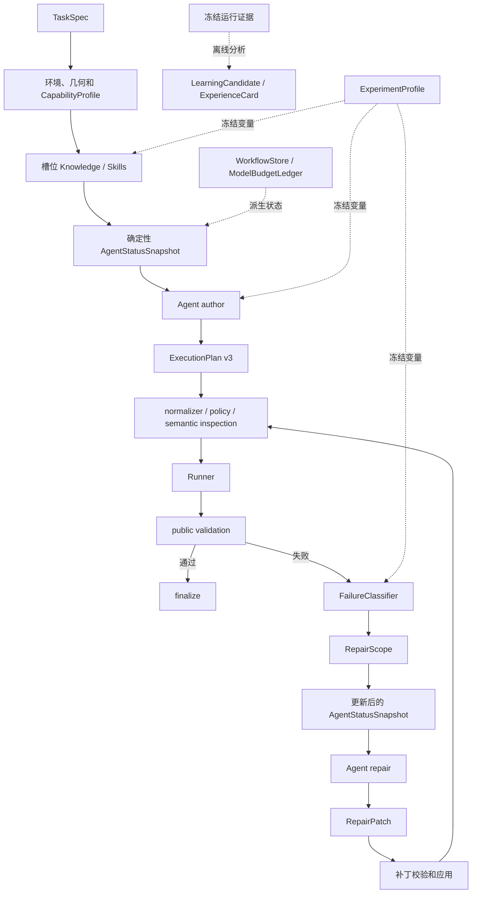

# FoamPilot Agent Harness 演进 v2 规格

状态：P0/P1 已实施并通过确定性与真实 OpenFOAM gate；P2/P3 尚未实施
日期：2026-08-06
适用基线：FoamPilot `904a9c4`
设计主题：确定性状态、定向修复、受控经验学习与可比较实验
架构定位：现有单 Agent CFD 主链的增量完善，不迁移通用 Agent 框架

> 本文记录适用基线上的 v3/RepairPatch 设计与验收。当前 canonical authoring 已迁移为
> CaseBundle、ExecutionPlan v4 和 RepairProposal；本文中的旧接口不是可用 fallback。

相关文档：

- [架构、运行流程与功能边界](../system-overview.md)
- [架构优化设计规格 v1](../architecture-optimization-design.md)
- [下一阶段顺序演进规格](README.md)
- [Knowledge 与 Skills 设计](knowledge-skills-design.md)
- [Performance v1 规格](performance-v1-design.md)
- [知识治理](../knowledge-governance.md)
- [P0/P1 实施与验证报告](../reports/2026-08-06-agent-harness-p0-p1.md)

## 1. 结论

FoamPilot 当前不需要迁移到 LangGraph、CrewAI、OpenAI Agents SDK、MCP 或多智能体框架。
现有系统已经是一个面向 CFD 的领域 Harness：模型负责物理判断和原生 case 编写，确定性程序
负责上下文、约束、执行、验证、恢复和证据。

本轮演进只补齐四个已被真实运行暴露的薄弱边界：

1. 为每次 author/repair 调用提供由程序生成的紧凑状态快照；
2. 把现有有限 repair 完善为“失败分类—范围选择—结构化补丁—受影响阶段重跑”；
3. 把运行经验沉淀为经过证据、隔离和人工批准的可检索经验，而不是让模型自动改写知识库；
4. 冻结 prompt、Knowledge、Skill、repair policy 等实验变量，使架构优化可以消融、比较和回滚。

以下能力只保留为后续条件式扩展，不进入本轮核心实现：

- 证据缺口驱动的额外知识检索；
- engineering policy 下的 CaseIR/family compiler；
- 面向桌面 IDE 的常驻作业服务。

## 2. 与现有规格的关系

本规格继承架构优化 v1 已实施的阶段 A、B，不替换以下既有组件和不变量：

- `TaskSpec`、`CapabilityProfile`、`AgentContext` 和 `ExecutionPlan v3`；
- `ModelGateway`、`WorkflowStore`、continuation 和不可变 artifact；
- typed command、Runner、bubblewrap/audited-host fallback；
- public validation 与 qualification evaluator 隔离；
- 目标 tutorial、golden 和私有 evaluator 不进入 author/repair 上下文；
- `NativeAgent.solve()` 是唯一规范求解入口。

本规格细化并取代架构优化 v1 中尚未实施的阶段 C、D。若两份文档在 repair scope、repair
operation 或学习数据契约上存在差异，以本规格为准。v1 已实施的阶段 A、B 仍以当前源码和对应
验收报告为准。

## 3. 当前基线与缺口

### 3.1 已有健康能力

当前主链已经具备：

```text
TaskSpec
→ 环境和几何事实
→ 确定性能力路由
→ 槽位式 Knowledge / Skills
→ 一次完整 ExecutionPlan v3 生成
→ 规范化、策略和语义检查
→ OpenFOAM 原生执行
→ 公开验证
→ 有界 repair
→ 工作流状态、续跑和不可变证据
```

它已经对应 Agent 工程中的 Plan-and-Execute、受限 ReAct、上下文工程、guardrail、独立验证、
sessionless 状态和有界故障恢复。继续叠加通用 Agent 框架不会自动增加 OpenFOAM 知识，也不会
提高字典正确率。

### 3.2 尚存缺口

1. `AgentContext` 记录所选知识和 Skill，但没有统一表达当前阶段、剩余预算、最新失败和允许动作；
2. mesh failure 已有局部 scope，其他 failure 仍可能把全部 case 文件交给 repair 模型；
3. repair 只能新增或替换文件、替换已有命令，不能插入缺失步骤或删除无效命令；
4. failure 分类、repair scope 和错误知识检索尚未形成同一个可审计数据链；
5. `LearningCandidate` 已具备离线 promotion 边界，但 root cause 和 improvement target 尚未覆盖
   provider、workflow、routing、context 和 family contract；
6. qualification 能比较结果，但尚未统一冻结所有上下文和策略变量，难以做严格消融；
7. `native_orchestrator.py` 同时承担较多阶段细节，后续修改 repair 和学习路径时容易扩大影响面。

## 4. 设计目标

### 4.1 必须达到

1. 模型在每个决策点都能看到准确、紧凑、可验证的运行状态；
2. 正常成功路径不增加模型调用；
3. 失败分类和 repair scope 由确定性证据优先产生，不额外调用 reviewer；
4. repair 只获得与当前失败相关的文件、字典块、日志和知识；
5. repair 可以安全地新增/替换文件以及插入、替换、删除 typed command；
6. 每个补丁在应用后重新经过完整 schema、policy、semantic inspection；
7. 修复后只复用可以由依赖关系证明未受影响的阶段；
8. 运行经验只能离线生成候选，不能自动进入正式 Knowledge、Skill 或 prompt；
9. 每次 qualification 能说明“哪些机制发生了变化”；
10. 保持单 Agent、单状态机、单 Runner 和单一 `solve()` 主入口。

### 4.2 质量属性

- **轻量**：不引入图框架、消息总线、向量数据库或常驻服务；
- **确定性优先**：状态、分类、预算和补丁校验由程序负责；
- **有界**：所有模型请求、检索、修复和 continuation 均有次数与时间预算；
- **可解释**：状态、失败分类、scope、补丁和学习来源均落盘；
- **可比较**：同一实验协议能够启用或关闭单个机制；
- **防泄漏**：学习和检索不暴露目标 tutorial、golden、私有 tolerance 或受保护路径；
- **不牺牲灵活性**：不确定的 CFD 语义仍由 Agent 判断，低置信度规则不机械阻断。

## 5. 非目标

本规格不实施：

- LangGraph、CrewAI、OpenAI Agents SDK 或第二套工作流状态机；
- 多智能体生成、互审或投票；
- MCP server；
- 开放式网络搜索或无界 Agentic RAG；
- 逐文件模型 reviewer；
- 自动生成、修改或发布 Knowledge/Skill；
- 逐题模板、逐题 renderer 或复制官方 example；
- 将完整 case 改为确定性 family compiler 输出；
- 扩展 Foundation OpenFOAM v10 之外的版本矩阵；
- 为本轮改造重写 Runner、Gateway、TaskBuilder 或 qualification 主链；
- 以降低 inspection、public validation 或 qualification 标准换取进入 solver 的速度。

## 6. 目标数据流



关键约束：

- `WorkflowStore` 和现有结构化对象仍是事实来源；`AgentStatusSnapshot` 只是可重建的投影视图；
- `FailureClassifier` 不决定 CFD 修复内容，只决定 failure taxonomy 和允许查看的证据范围；
- `RepairPatch` 不直接执行命令，只描述对 `ExecutionPlan` 的受控变更；
- `ExperienceCard` 只在离线治理后进入指定 release，不能从当前 run 直接反馈给同一道题。

## 7. P0：AgentStatusSnapshot

### 7.1 职责

状态快照在 author 和 repair 请求前由确定性代码构造，用于回答：

- 当前处于哪个阶段；
- 已完成哪些阶段；
- 当前 solver family 和 solver 是什么；
- 已使用和剩余多少预算；
- 最新公开失败是什么；
- 本次模型允许执行哪些动作；
- 哪些任务约束和资产不可修改。

模型不得生成或修改状态快照。

### 7.2 数据契约

```yaml
schema_version: 1
source_event_sequence: 17
current_stage: repair
last_completed_stage: PUBLIC_VALIDATION_COMPLETE
attempt:
  current: 1
  maximum: 2
capability:
  solver_family: multiphase_vof
  solver: interFoam
  regions: [default]
latest_failure:
  domain: solver
  code: missing_dictionary_keyword
  step_id: solve
  retryable: false
budget:
  model_logical_requests_remaining: 1
  transport_attempts_remaining: 3
  execution_seconds_remaining: 480
context:
  knowledge_ids: [of10.vof.boundary-contract]
  skill_names: [foampilot-native-case, multiphase-vof]
allowed_actions:
  - add_file
  - replace_file
  - insert_command
  - replace_command
  - remove_command
immutable_constraints:
  public_assets: [geometry/input.stl]
  protected_path_count: 2
  openfoam_distribution: foundation
  openfoam_version: "10"
```

author 阶段尚无失败时，`latest_failure` 为 `null`。`current_stage` 使用独立的决策阶段枚举
`author | repair`；`last_completed_stage` 使用现有 `WorkflowStage`，两者不能混用。

`protected_paths` 原文不进入快照，只记录数量或不可逆摘要，避免状态栏本身造成泄漏。

### 7.3 构造与一致性

快照只能从以下已校验对象构造：

- `TaskSpec`；
- `CapabilityProfile`；
- `AgentContext` 的 Knowledge/Skill 标识和 hash；
- `WorkflowStore` 最新事件；
- `ModelBudgetLedger`；
- 当前 `ExecutionPlan` 和最新 `FailureRecord`。

构造器必须验证 stage、attempt、budget 和 latest failure 相互一致。无法构造可靠快照时，在模型调用
前以 `AGENT_STATUS_INCONSISTENT` 结束，提供中文 `message` 与 `recovery`，不得发送猜测状态。

### 7.4 注入和产物

- author：在任务、能力和知识之后注入快照；
- repair：在失败证据和 RepairScope 之后注入更新后的快照；
- 快照保持短小，不重复完整 TaskSpec、plan 或日志；
- 每次调用前写入 `agent-status-<purpose>-<attempt>.json`，并记录内容 hash；
- trace 只记录状态文件路径和 hash，不复制 prompt 正文。

## 8. P1：定向修复闭环

### 8.1 FailureClassifier

分类器只读取结构化运行结果和有界日志，不调用模型。输入包括：

- 失败 command 的 `stage`、返回码、超时和 executable；
- `PublicValidationReport`；
- `MeshQualityReport`；
- semantic inspection issue；
- 已去除环境秘密的日志尾部；
- 既有 `FailureRecord`。

输出：

```yaml
schema_version: 1
domain: solver
code: missing_dictionary_keyword
confidence: high
failed_stage: solve
failed_step_id: solve
evidence:
  - kind: log_pattern
    value: keyword div(phi,K) is undefined
scope_hints:
  files: [system/fvSchemes]
  dictionary_blocks: [divSchemes]
  commands: [solve]
allowed_operations: [replace_file]
```

`confidence` 由规则证据计算，不能接受模型自报值。无法高置信度分类时使用通用 code
`unclassified_native_failure`，保留原始 failure domain 和 stage；不得为了得到具体标签增加一次模型
调用。

### 8.2 RepairScope

`RepairScope` 根据 failure classification、CaseManifest、文件依赖、command stage 和 family
contract 选择最小必要上下文：

```yaml
schema_version: 1
failure_code: missing_dictionary_keyword
relevant_files:
  - path: system/fvSchemes
    content_mode: matching_block
    block: divSchemes
    sha256: "..."
relevant_commands:
  - solve
relevant_knowledge_ids:
  - of10.buoyant.divergence-contract
allowed_operations:
  - replace_file
earliest_possible_rerun_stage: inspection
excluded_file_count: 12
```

文件内容模式只允许：

- `full`：小型且完整内容直接相关；
- `matching_block`：只发送相关 OpenFOAM dictionary block，同时保存原文件 hash；
- `head_tail_excerpt`：日志或无法解析的大文本；
- `structure_only`：发送字典层级、field/patch/region 元数据；
- `metadata_only`：路径、大小和 hash。

大文件不能仅因超过固定字节数而使整次 repair 失败。只有无法提取足够证据且完整内容超出预算时，
才返回 `REPAIR_SCOPE_UNRESOLVED`。

### 8.3 RepairPatch

repair 模型不再返回一组含义模糊的 changed commands，而是返回显式操作：

```yaml
schema_version: 1
because: public failure evidence points to a missing div scheme
evidence: [missing_dictionary_keyword]
file_operations:
  - operation: replace
    path: system/fvSchemes
    content: "...完整的新文件内容..."
command_operations:
  - operation: insert_before
    anchor_step_id: solve
    command:
      step_id: initialize_fields
      stage: initialize
      executable: setFields
      args: []
      mpi_ranks: 1
      timeout_seconds: 60
expected_check: solver reaches the first time step
stable_control: geometry, physical properties and boundary values remain unchanged
```

文件操作首期只支持：

- `add`；
- `replace`。

命令操作支持：

- `insert_before`；
- `insert_after`；
- `replace`；
- `remove`。

删除可选 function object 通过替换相应字典完成，不增加删除文件操作。这样可以满足当前已知修复
需要，同时避免扩大文件生命周期规则。

### 8.4 补丁校验

应用前必须验证：

1. 操作路径属于当前 case，且不是 public asset；
2. 补丁不包含 protected path、shell 或外部绝对路径；
3. command anchor 存在，新增 `step_id` 唯一；
4. command stage 顺序合法；
5. 修改没有超出 `RepairScope.allowed_operations`；
6. 补丁至少改变一个受保护范围外的字节或 command；
7. 应用后的完整 ExecutionPlan 再次通过 schema、normalizer、policy 和 semantic inspection；
8. repair reuse 根据实际修改集合重新计算，不能相信模型声明的重跑起点。

失败返回 `REPAIR_PATCH_INVALID`，保存具体 issue，不再调用第二个模型 reviewer。

### 8.5 修复预算和停止条件

继续沿用 TaskSpec 的 `max_attempts`、Gateway stage deadline 和 lineage budget，并保留以下停止条件：

- 重复 failure fingerprint；
- no-op 或字节未变化；
- repair patch 无法通过确定性校验；
- 环境或 provider terminal blocker；
- attempt、模型调用或总执行时间耗尽。

所有路径必须有限。不能通过创建 continuation 绕过 lineage 累计预算。

## 9. P2：受控经验学习

### 9.1 原则

运行失败可以产生候选经验，但不能直接改变下一次正式求解行为。经验治理顺序固定为：

```text
冻结 run
→ 离线 root-cause analysis
→ LearningCandidate
→ development / regression / holdout
→ PromotionReport
→ 人工批准
→ 版本化 Experience release 或 Knowledge/Skill 变更
```

### 9.2 扩展学习路由

`RootCause` 增加：

- `provider`；
- `workflow`；
- `routing`；
- `context`；
- `family_contract`。

`ImprovementTarget` 扩展为：

- `provider_gateway`；
- `orchestrator`；
- `task_builder`；
- `router`；
- `context`；
- `knowledge`；
- `skill`；
- `family_contract`；
- `prompt`；
- `inspection`；
- `runner`；
- `evaluator`。

这使系统能够区分“应教模型什么”与“应修复哪个确定性组件”。provider 过载不得被转成 OpenFOAM
知识；evaluator 偏差不得被转成 solver family Skill。

### 9.3 ExperienceCard

`ExperienceCard` 是可检索的、经过批准的失败经验，不保存完整 case：

```yaml
schema_version: 1
experience_id: of10.vof.optional-function-object.compatibility
source_candidate_id: candidate-20260806-001
applicability:
  distribution: foundation
  versions: ["10"]
  solver_families: [multiphase_vof]
failure_signature:
  domain: solver
  codes: [unknown_function_object_type]
generalized_lesson: optional post-processing objects must match the target distribution
successful_action_classes: [replace_file]
must_preserve:
  - physical boundary conditions
  - solver selection
evidence:
  source_manifest_sha256: "..."
  promotion_report_sha256: "..."
leakage_guard:
  excluded_task_ids: []
  excluded_families: []
```

经验卡禁止包含：

- 官方目标 case 路径或完整文件；
- golden value、私有 tolerance 或 evaluator implementation；
- 只对单题成立的几何尺寸、patch 数值或答案；
- 未经验证的模型反思；
- 凭据、主机路径和环境秘密。

### 9.4 检索和冻结

- generation 默认仍以通用 Knowledge/Skill 为主，不无条件注入全部经验；
- repair 可根据 solver family、failure code 和 OpenFOAM version 选择至多一张经验卡；
- selection 记录 `experience-selection.json`、release ID、card ID 和 hash；
- qualification 必须固定 experience release；
- 产生某张卡的目标任务不得在同一实验中使用该卡重新评测并冒充 blind result；
- release 变化属于 `rerun_with_changes`，不能 strict resume。

## 10. P3：ExperimentProfile 与消融

### 10.1 目的

Qualification 不仅报告最终通过率，还必须明确本轮使用了哪些 Agent 机制。否则模型、prompt、
Knowledge、Skill 和 repair 同时变化时，无法判断改进来源。

### 10.2 数据契约

```yaml
schema_version: 1
profile_id: harness-v2-default
execution_plan_schema: 3
prompt_bundle_sha256: "..."
knowledge_release:
  id: knowledge-20260806
  sha256: "..."
skill_release:
  id: skills-20260806
  sha256: "..."
experience_release:
  id: none
  sha256: null
features:
  agent_status_snapshot: true
  scoped_repair: true
  command_patch_operations: true
  experience_retrieval: false
  evidence_gap_retrieval: false
repair_policy_sha256: "..."
normalizer_sha256: "..."
semantic_contract_sha256: "..."
```

普通 solve 使用随 package 发布的默认 profile，并把解析后的 profile 写入 run。qualification 必须
显式冻结 profile、backend、model、suite 和 evaluator protocol。profile 只控制可消融机制，不能
关闭安全策略、泄漏防护、artifact manifest 或 evaluator 隔离。

默认 profile 必须开启 P0—P3 已实施且已经通过 gate 的机制。关闭状态快照或 scoped repair 只允许
用于显式标记的 qualification 消融 profile，不能成为普通 solve 的隐式运行模式。

### 10.3 指标分层

报告至少区分：

**机制指标**

- author/repair logical request 数；
- transport attempt 数；
- author/repair 上下文字节数；
- scope 排除文件数；
- repair 操作类型；
- 实际重跑起点；
- experience 命中率。

**目标指标**

- case bundle 生成率；
- mesh generation 和 `checkMesh` 通过率；
- target solver 启动率；
- solver 正常结束率；
- public validation 和 physics qualification 通过率。

**护栏指标**

- 端到端耗时和首个 OpenFOAM command 时间；
- provider/environment blocker；
- schema invalid；
- semantic inspector 误拒绝；
- regression/holdout 退化；
- evaluator protocol 变化。

消融比较必须使用同一 TaskSpec、公开资产、backend/model、qualification protocol 和资源预算。
非单变量比较必须明确标注，不能声称因果改进。

## 11. 条件式扩展：证据缺口检索

本能力不随 P0—P3 自动实施。只有冻结基线证明以下问题反复发生时，才进入单独设计：

- 已正确路由，但必要知识槽位持续为空；
- repair failure code 没有匹配的 family contract 或经验；
- 缺失上下文被离线分析确认为主要失败原因，而非 case 推理错误或 provider 故障。

若启用，首版必须满足：

1. 只查询仓库内经过治理的公开 Knowledge/Experience；
2. 每个 author 或 repair 阶段至多一次查询；
3. 查询受当前 solver family、缺失 slot 或 failure code 约束；
4. 检索结果明确标记为“数据”，不能覆盖系统约束或 TaskSpec；
5. 不访问网络、目标 tutorial、golden 或 evaluator；
6. 额外查询和上下文大小进入性能报告；
7. 通过消融证明收益后才进入默认 profile。

不在 ExecutionPlan schema 中加入 `NeedMoreContext` 联合响应，避免重现结构化输出变复杂后整个 case
bundle 作废的问题。

## 12. Orchestrator 内部边界

本规格不进行大爆炸式重写。实施 P0/P1 时，只在被修改的路径上逐步提取以下内部服务：

| 内部边界 | 单一职责 |
| --- | --- |
| `StatusSnapshotBuilder` | 从现有事实源构造并校验状态快照 |
| `FailureClassifier` | 从公开结构化证据产生 failure taxonomy |
| `RepairScopeBuilder` | 选择相关文件、块、命令和知识 |
| `RepairPatchApplier` | 校验、应用补丁并生成修改集合 |
| `ExperienceSelector` | 从固定 release 中选择至多一张经验卡 |

`NativeAgent.solve()` 和 `NativeAgent.resume()` 继续协调阶段顺序；`WorkflowStore` 继续保存状态；Runner
继续执行命令。不得引入 graph runtime、事件总线或新的后台进程。

仅当相关逻辑已经有独立测试并被新服务接管后，才删除 orchestrator 内的旧逻辑。不得长期保留两套
repair 路径。

## 13. 错误与用户输出

新增错误保持稳定英文 `code`，并提供中文 `message` 和 `recovery`：

| code | 含义 |
| --- | --- |
| `AGENT_STATUS_INCONSISTENT` | 无法从事实源构造一致状态 |
| `FAILURE_CLASSIFICATION_INVALID` | 分类产物与原始失败证据冲突 |
| `REPAIR_SCOPE_UNRESOLVED` | 在上下文预算内无法得到足够修复证据 |
| `REPAIR_PATCH_INVALID` | repair 操作越界或应用后计划无效 |
| `EXPERIENCE_RELEASE_INCOMPATIBLE` | 经验 release 与当前版本或实验不兼容 |
| `EXPERIMENT_PROFILE_INVALID` | profile 缺字段、hash 不符或试图关闭强制护栏 |

错误分类不能覆盖原始 CFD failure。终态继续分别保存 `primary_failure` 和 `terminal_blocker`。

## 14. 新增运行产物

按实际发生阶段保存：

```text
agent-status-author-01.json
agent-status-repair-01.json
failure-classification-attempt-01.json
repair-scope-attempt-01.json
repair-patch-attempt-01.json
experience-selection.json
experiment-profile.json
```

所有文件进入 artifact manifest。状态快照、scope 和 selection 可从事实源重建，但已经用于某次模型
调用的版本必须冻结，保证事后能够解释当时模型看到了什么。

## 15. 实施顺序与 gate

### P0：状态快照

- 增加 schema、builder、artifact 和 author/repair 注入；
- 成功路径模型调用数不增加；
- fake gateway 测试证明模型收到的状态与 WorkflowStore、budget 一致；
- strict resume 能重建兼容状态，状态来源发生实质变化时拒绝伪装续跑。

### P1：定向修复

- 增加 FailureClassifier、RepairScope 和 RepairPatch；
- 覆盖 mesh、initialization、solver、postprocess 和 public validation failure；
- 覆盖命令 insert/replace/remove；
- 冻结成功/失败 artifact replay 不被新分类器错误拒绝；
- 至少用一个“缺命令”和一个“多余命令”的真实 OpenFOAM case 验证闭环。

### P2：受控经验学习

- 扩展学习路由；
- 增加 ExperienceCard、release 和 selection；
- 验证来源、泄漏、holdout 和人工 promotion gate；
- 同源任务禁止以经验命中结果冒充 blind qualification。

### P3：实验与消融

- 默认 profile 不改变安全边界；
- qualification 报告 profile hash 和三层指标；
- 对状态快照、scoped repair 和 experience retrieval 分别支持单变量消融；
- 非严格 A/B 在报告中自动标记为不可做因果归因。

### P4：是否启用证据缺口检索

P0—P3 完成后的 qualification 结果决定是否进入。没有重复的上下文缺失证据时，不实施。

## 16. 测试策略

### 16.1 单元测试

- 状态快照构造、一致性、脱敏和 hash；
- failure pattern、confidence 和 unknown fallback；
- dictionary block、日志 excerpt 和大文件 scope；
- 每种 RepairPatch 操作及越界拒绝；
- 修复后 ExecutionPlan 全量再校验；
- ExperienceCard provenance、泄漏和 release compatibility；
- ExperimentProfile hash、不可关闭护栏和指标聚合。

### 16.2 冻结产物 replay

至少覆盖：

- 单区域成功 case；
- MPI case；
- include 或大文件 case；
- buoyant case；
- VOF case；
- 多区域 case；
- 已知 solver failure；
- 已知 provider blocker。

replay 用于区分“新机制错误拒绝旧合法 case”与“新模型随机生成了不同 case”。

### 16.3 集成测试

- fake provider：成功、schema invalid、overload、stream interrupted；
- fake Runner：mesh failure、solver failure、验证 failure；
- parent failure → repair provider deferred → child continuation；
- same failure fingerprint 停止；
- scoped repair 后按实际修改集合复用阶段；
- qualification worker 共享 Gateway，但不共享 case 状态。

### 16.4 真实 OpenFOAM gate

在 Foundation OpenFOAM v10 上至少验证：

1. 一个单区域成功 case，确认正常路径只有一次 author 请求；
2. 一个缺少初始化命令的 case，确认能插入 command 并进入 solver；
3. 一个包含不兼容可选 function object 的 case，确认通过替换字典修复；
4. 一个 VOF 或 buoyant case，确认 family-specific scope；
5. 一个多区域 case，确认 region-aware manifest 未被 repair 破坏。

### 16.5 Qualification gate

使用冻结 suite 做基线与候选对比，至少满足：

- 环境/bubblewrap 交互阻断不增加；
- 正常成功路径的模型 logical request 不增加；
- target solver started 不低于基线；
- public validation 和 physics qualification 不发生未解释退化；
- repair prompt 不再包含与分类和 scope 无关的文件正文；
- provider failure 不被归入 case、知识或 solver family 问题；
- 所有指标能够回溯到冻结 artifact。

## 17. 完成定义

只有同时满足以下条件，本规格才可以标记为已实施：

1. P0—P3 均有源码、测试、迁移和中文文档；
2. `NativeAgent.solve()` 仍是唯一求解主链；
3. 不存在旧 `RepairDecision` 与新 `RepairPatch` 两套长期 canonical 路径；
4. 正常成功路径没有新增模型调用；
5. 冻结 replay、全量确定性测试和真实 OpenFOAM gate 通过；
6. qualification 报告能区分机制、目标和护栏指标；
7. Experience 不能自动 promotion，且泄漏测试通过；
8. artifact manifest 覆盖新增产物；
9. README、系统概览和 AGENTS.md 只描述实际已实现能力，不提前宣称设计完成；
10. 是否实施证据缺口检索由 P0—P3 的真实证据决定，而不是由本规格自动授权。

## 18. 最终架构边界

本轮完成后的 FoamPilot 仍然是：

```text
一个领域 Agent
+ 一个确定性 CFD Harness
+ 一个本机 OpenFOAM Runner
+ 一个独立 qualification 边界
+ 一个离线、受治理的持续学习闭环
```

它不会成为通用 Agent 平台。架构演进的衡量标准不是引入多少框架，而是能否让一个新的、完整的
CFD 任务更稳定地进入 OpenFOAM、在失败后获得证据充分且范围有限的修复，并留下可复现、可比较、
可审计的结果。
