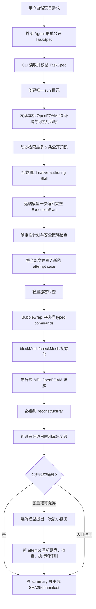

# FoamPilot 单算例工作流与求解前健康度分析（历史基线）

> 本文记录模型后端重构前的故障证据与架构诊断，文中的旧客户端名称和能力缺口不代表
> 当前实现。当前流程以 [system-overview.md](system-overview.md)、
> [architecture.md](architecture.md) 和源码测试为准。

## 1. 文档目的

本文回答三个问题：

1. 当前 FoamPilot 面对一个算例时，从用户需求到最终结果的完整工作流
   是什么；
2. 为什么多次真实执行把绝大部分时间花在 OpenFOAM 求解之前，以及
   求解前为什么会失败；
3. 这些问题分别属于知识与 Skills、Agent case 编写能力、OpenFOAM
   数值求解、外部模型服务，还是 FoamPilot 自身的流程与架构。

本文描述的是 2026-07-30 本地 `main` 加未提交改动的真实实现，不是
目标架构设想。分析依据包括当前源码，以及新增 10 题的 v2 至 v5 串行
复测产物。

## 2. 核心结论

当前 FoamPilot 已经形成一条功能完整的闭环：

```text
公开任务
→ 动态公开知识
→ 模型编写完整 OpenFOAM case
→ 安全检查
→ OpenFOAM 前处理与求解
→ 公共评测
→ 一次证据约束的修复
→ 不可变产物
```

但它还不是一条具备批量场景生产韧性的健康流水线。

主要判断如下：

- OpenFOAM、本地知识检索、case 落盘和静态检查都不是当前的主要耗时
  来源；
- 当前最大耗时和最大不确定性来自远端模型调用；
- `server_is_overloaded` 的直接根因在外部模型服务，但 FoamPilot 把
  该服务同步放在每题的必经关键路径上，又缺少服务健康检查、批次熔断、
  断点续写、延后恢复和备用 provider，因此故障被架构放大；
- 当前一次模型调用必须返回全部 case 文件和命令，传输或结构化输出
  失败会丢弃整个结果；
- 首次 case 失败后，修复还需要第二次同类模型调用；修复调用过载时，
  顶层状态会变成 `BLOCKED_ENVIRONMENT`，虽然 attempt 内仍保存了原始
  求解失败，但批次摘要容易掩盖真正的 CFD 根因；
- 静态检查本身只需毫秒级时间，不是“审查过重”的主要来源；但是误报会
  额外触发一次昂贵的修复模型调用，因此检查准确性仍然影响总耗时；
- 知识库和 Skills 的不足主要影响 case 是否正确、是否能进入求解以及
  数值是否稳定，不能解决模型服务过载；
- MCP 也不能解决这个问题。增加 MCP 只会改变工具接入方式，不会为
  同步模型请求提供容量、断点恢复或可用性保证。

因此，应同时评价两个相互独立的能力轴：

1. **CFD 编写与求解能力**：在模型成功返回 case 的条件下，网格、
   字典、物理模型、数值格式和边界条件是否正确；
2. **端到端运行可靠性**：从任务提交开始，是否能在受控时间内稳定
   生成 case、启动 OpenFOAM，并在环境故障后恢复。

当前第一条能力轴已经能够持续学习；第二条能力轴仍需优先补强。

## 3. 当前真实入口

### 3.1 人与 Agent 的入口边界

FoamPilot CLI 当前不直接接收一段任意自然语言并自行生成 TaskSpec。
真实边界是：

```text
用户自然语言需求
→ 外部 Agent/Codex 整理成公开 TaskSpec YAML
→ foampilot solve TASK.yaml
```

TaskSpec 包含：

- 标题和公开物理需求；
- Foundation OpenFOAM 版本；
- 资源预算；
- 需要保留的输出；
- 公开验收要求；
- evaluator 可以执行的公开检查；
- 可选公开资产；
- 不允许 Agent 访问的受保护路径。

`TaskSpec.agent_payload()` 会排除 `public_checks` 和
`protected_paths`。也就是说，内部 case-authoring 模型能看到公开需求，
但看不到目标 tutorial 路径、评测器内部规则和 golden 数据。

### 3.2 CLI 入口

标准命令是：

```bash
foampilot solve TASK.yaml \
  --run-root RUN_ROOT \
  --model-name MODEL \
  --max-mpi-ranks N \
  --json
```

CLI 当前固定创建 `CodexOAuthModelClient`，核心代码虽然定义了通用
`ModelClient` Protocol，但 CLI 尚未暴露 provider 选择、备用 provider
或离线 provider 切换。

## 4. 从头到尾的工作流



### 4.1 创建 run 与发现环境

`NativeAgent.solve()` 首先创建唯一 run 目录并保存 `task.yaml`，随后：

- source `/home/edwin/workplace/OpenFOAM-10/etc/bashrc`；
- 确认 Foundation 版本；
- 扫描 OpenFOAM 可执行程序；
- 检查 MPI、Gmsh 和工作区可写性；
- 将完整事实快照保存为 `environment.json`；
- 只把压缩后的版本、程序名和资源能力发送给模型。

这一阶段是本地确定性操作。最近 run 中通常约为 0.2 至 0.3 秒。

注意：`foampilot preflight` 只检查本机 Python、OpenFOAM、执行后端
和一个代表性 solver。它不检查远端模型服务是否健康。

### 4.2 动态知识和 Skill

`load_agent_context()` 按 solver family、mesh、boundary、physics/transport、
startup/numerics 和可选 parallel/error 槽位检索公开知识；每个槽位至多选择一条，
并根据 `CapabilityProfile` 注入通用 Skill 和可用的 solver-family Skill。它不是对整个
知识库做无差别 top-N 填充。

这一阶段通常约为几十毫秒，不是性能瓶颈。它的风险在于召回质量，而不
是运行时间：

- top-5 容量有限；
- 当前匹配以确定性的词项相关性为主；
- solver 名明确时已有加权，但相邻主题仍可能占用上下文；
- Skills 包装能力和内部运行时实际注入能力存在差距。

这些问题可能导致字典或数值策略不够准确，但不会导致
`server_is_overloaded`。

### 4.3 一次模型调用编写完整 case

`author_case_bundle()` 构造一个结构化模型请求。请求中包含：

- 公开 TaskSpec；
- 压缩后的环境能力；
- 动态检索的公开知识；
- 通用 native authoring Skill；
- `ExecutionPlan` JSON Schema。

模型必须在一个响应中返回：

- case 中每个文件的相对路径；
- 每个文件的完整 UTF-8 内容；
- 所有 typed commands；
- 每条命令的参数、MPI ranks 和 timeout。

这一步的优点是流程简单，没有逐文件 reviewer，也避免大量模型往返。
缺点是它是一个较大的、全有或全无的同步事务：

- 一个复杂 case 可能包含许多完整 OpenFOAM 字典；
- 多块网格会产生较长的 `blockMeshDict`；
- 非均匀初始化可能产生较长字段或 include 片段；
- 响应必须完整结束并一次通过 Pydantic schema 校验；
- SSE 连接中断、服务过载或最后一段 JSON 缺失都会丢弃整包结果；
- 当前没有部分响应落盘、断点续写或从已接收文件继续的能力。

经过环境 payload 压缩后，代表性用户 prompt 已从 62,279 字符降至
25,635 字符，但完整输出本身仍可能较大。

### 4.4 模型传输重试

当前默认策略是：

- 最多 5 次完整模型请求；
- 退避 5、15、45、90 秒，总退避 155 秒；
- 每次 HTTP 请求 timeout 为 300 秒；
- 每次重试都会重新发起完整生成；
- 不读取服务端 `Retry-After`；
- 没有随机抖动、批次级熔断或请求队列；
- 没有从失败 SSE 的部分内容继续；
- 没有独立的端到端生成时限。

因此，一个没有任何 case 产出的任务仍可能等待约 3 分钟；如果每次请求
都接近 300 秒 timeout，理论等待还会更长。TaskSpec 中的
`max_wall_seconds` 约束的是 OpenFOAM typed commands 的 timeout 总和，
不约束模型生成和模型重试。

CLI 只在完整生成或最终错误时输出结构化结果。模型流虽然以 SSE 接收，
但中间进度没有转成用户可见事件，所以等待期间表现为长时间无输出。

### 4.5 ExecutionPlan 策略检查

模型响应通过 schema 后，`validate_execution_plan()` 检查：

- 文件路径是否安全、唯一；
- 是否覆盖公开资产；
- 是否引用受保护路径；
- command step ID 是否唯一；
- executable 是否存在；
- timeout 总和是否超预算；
- MPI ranks 是否超预算；
- 是否包含 shell、主机选择或外部绝对路径。

这一层只判断安全、资源和命令形状，不判断 CFD 策略。

当前一个重要行为是：初始 plan 一旦在这一层失败，会直接
`PLAN_INVALID` 结束，不会进入 evidence-scoped repair。这能保证安全，
但也意味着 `mpirun`、`orterun` 或一个可修复 command 形状错误会在
求解前结束整题。

### 4.6 case 落盘和静态检查

通过计划检查后，FoamPilot：

1. 创建全新的 `attempt-XX/case`；
2. 原子写入全部 Agent 生成文件；
3. 保存生成文件哈希；
4. 执行轻量 `inspect_native_case()`。

静态检查只阻断机械确定的问题，例如：

- 文件不存在；
- 明确缺少 `FoamFile` 头；
- 括号不平衡；
- 显式 mesh patch 未被 field 覆盖；
- 已知不兼容的 function object；
- 受保护路径泄漏。

遇到 include、变量替换或无法可靠解析的语法时，设计目标是给 advisory
并让 OpenFOAM 决定，而不是机械拒绝。

这一阶段通常是毫秒至几十毫秒级，不是长时间等待的来源。但是误报会
带来间接成本。例如 blocked-channel 中，旧检查器错误要求 `.inc` 文本
片段包含 `FoamFile` 头，直接阻止本地命令并触发第二次模型修复调用。

### 4.7 OpenFOAM 前处理和求解

`PlanRunner` 不接受 Agent 编写的 shell。它把 typed command 转换为：

- 串行：`executable + argv`；
- 并行：Runner 注入 `mpirun -n N ... -parallel`。

每一步优先在 bubblewrap 中执行：

- case 目录挂载到 `/case`；
- OpenFOAM 安装只读；
- tutorial 目录被空 tmpfs 遮蔽；
- 网络隔离；
- CPU 时间和地址空间受限；
- stdout/stderr 分别落盘。

`execution_backend=auto` 会缓存一次 bubblewrap 能力探测；namespace 被嵌套环境拒绝时，
Runner 改用 audited host 后端，并保留 typed allowlist、cwd、资源限制与日志。host fallback
不提供 network namespace 隔离，后端与原因会写入 step result。

典型命令顺序为：

```text
blockMesh 或其他网格生成
→ checkMesh
→ setFields/topoSet/其他初始化
→ decomposePar
→ OpenFOAM solver
→ reconstructPar
```

`checkMesh` 即使返回码为 0，只要日志明确出现
`Failed N mesh checks`，Runner 也会停止后续命令。

只有到这一阶段才真正使用 OpenFOAM。MPI 只能加速声明为并行的本地
命令，无法加速此前的模型生成。

### 4.8 公共评测

执行结束后，`validate_native_run()` 检查 TaskSpec 声明的公开条件，
例如：

- `Mesh OK`；
- 目标 executable 成功执行；
- solver 正常结束；
- 达到目标时间或迭代；
- 日志中没有非有限值；
- 请求字段存在；
- 连续性、相分数、物理量或守恒指标满足公开限制。

评测器拥有检查逻辑，Agent 不看到这些具体检查。返回码为 0 只代表命令
执行完成，不自动等于收敛或物理正确。

### 4.9 一次证据约束修复

如果静态检查、OpenFOAM 命令或公开验证失败，且 attempt 预算允许，
FoamPilot 会再次调用远端模型。修复模型看到：

- 公开 TaskSpec；
- 当前 plan 和完整生成文件；
- 公开验证报告；
- 失败日志；
- 同一批动态知识和通用 Skill。

模型只能提出最小文件或已有 typed command 修改。修改在新的 attempt
中重新执行，旧 attempt 不被覆盖。

这使流程形成闭环，但第二次模型调用也是一个同步、全量上下文的远端
依赖。若首次 OpenFOAM 失败只花了 0.5 秒，而修复服务过载等待了 180
秒，总时间仍几乎全部消耗在模型边界。

当前还有一个状态表达问题：如果首次 attempt 是 `SOLVER_FAILED`，但
修复模型调用因过载失败，顶层 run 状态会变成
`BLOCKED_ENVIRONMENT`。原始 solver failure 仍保存在 attempts 和日志
中，但只看 summary 容易误以为该题从未进入求解。

### 4.10 产物冻结

无论通过或失败，`_finish()` 都会写：

- model configuration；
- run summary；
- 每个 attempt 的 plan、case、日志和公开验证；
- SHA-256 artifact manifest。

`foampilot report RUN_DIR --json` 会重新验证 manifest。正式汇报时应将
`solve` 状态和 manifest 验证一起使用。

## 5. 最近复测的时间证据

### 5.1 统计口径

以下时间由 run 目录名称、文件 mtime 和 `run-result.json` 的命令时间戳
计算，精确到约 0.1 秒。它们用于判断数量级，不代表完整 tracing 系统。

`pre_first_command_s` 表示从创建 run 到第一条 OpenFOAM command 启动；
如果从未生成 case，则整段 run 时间都属于 OpenFOAM 之前。

### 5.2 v5 六个未决题

| 题目 | 总耗时/s | 第一条 OpenFOAM 命令前/s | 是否形成有效 attempt | 最终状态 |
| --- | ---: | ---: | --- | --- |
| charged wire | 173.1 | 173.1 | 否 | `BLOCKED_ENVIRONMENT` |
| porous blockage | 277.3 | 271.2 | 是 | PASS |
| Bénard cells | 174.8 | 174.8 | 否 | `BLOCKED_ENVIRONMENT` |
| blocked channel | 172.9 | 172.9 | 否 | `BLOCKED_ENVIRONMENT` |
| cyclic pipe | 118.2 | 113.8 | 是 | PASS |
| square bend | 176.8 | 176.8 | 否 | `BLOCKED_ENVIRONMENT` |

六题合计约 1093.1 秒，其中约 1082.6 秒发生在第一条 OpenFOAM 命令
之前，约占 99%。这说明本轮“求解前耗时”不是网格检查或 OpenFOAM
启动慢，而是模型生成和模型重试占据关键路径。

### 5.3 两个通过题的阶段拆分

| 阶段 | porous blockage/s | cyclic pipe/s |
| --- | ---: | ---: |
| 环境发现与知识上下文 | 约 0.3 | 约 0.3 |
| 模型生成完整 case bundle | 约 270.8 | 约 113.4 |
| case 落盘与静态检查 | 约 0.04 | 约 0.05 |
| OpenFOAM commands | 约 5.1 | 约 4.0 |
| 公共验证与结束 | 约 1.1 | 约 0.5 |

即使最终通过，模型生成仍比本地 OpenFOAM 执行慢一到两个数量级。

### 5.4 修复调用的放大效应

v4 Bénard cells：

- 环境与上下文约 0.3 秒；
- 首次完整 case 生成约 142 秒；
- `blockMesh`、`checkMesh` 和 `buoyantFoam` 启动约 0.5 秒；
- solver 暴露明确字典错误；
- 随后的修复模型调用等待约 183 秒后被服务过载阻断；
- 总耗时约 325.5 秒。

因此，该题虽然从 CFD 角度很快就给出了可修复错误，但端到端流程又花了
数分钟等待修复模型服务。

## 6. 为什么会在求解前失败

### 6.1 外部模型服务不可用

实际 SSE 错误是：

```text
server_is_overloaded:
Our servers are currently overloaded. Please try again later.
```

直接根因是外部服务容量，不是 OpenFOAM、知识库、Skills、MPI、MCP 或
本地硬件。

但是架构决定了影响范围：

- 模型是每题生成 case 的唯一入口；
- 没有模型响应就没有任何可执行 case；
- 每题独立重复 5 次；
- 批量任务不知道前一题已经证明服务过载；
- 没有稍后从 generation 或 repair 阶段恢复的命令；
- 没有替代 provider；
- 所以一个外部容量故障会阻止整个批次进入 OpenFOAM。

这是“外部根因、架构放大”的典型问题。

### 6.2 模型输出没有通过 schema

模型即使返回文本，也可能不是完整 `ExecutionPlan` JSON，或者字段缺失、
类型错误。该错误被分类为 `CASE_GENERATION_FAILED`，不会得到 transport
重试，也不会进入 repair。

整包输出越长，末尾截断或 JSON 不完整的影响越大。

### 6.3 plan 安全策略失败

模型可能生成：

- `mpirun` 或 `orterun`；
- shell 符号；
- 未安装 executable；
- 超出 MPI 或 timeout 预算；
- 外部绝对路径；
- 受保护路径。

这些问题发生在 case 落盘和 OpenFOAM 之前。当前初始 plan policy
失败直接终止，不执行一次安全范围内的 plan repair。

### 6.4 静态检查误报或真实错误

真实错误包括明确缺 patch、文件头或括号不匹配。误报示例是把 `.inc`
片段当成完整 OpenFOAM 文件。

静态检查计算成本很低，但任何 blocking issue 都会触发第二次远端模型
调用，所以误报的时间成本很高。

### 6.5 Agent case 编写错误在前处理阶段暴露

即使 case 已经落盘，以下错误会在 solver 前暴露：

- block 顶点顺序或共享面不一致；
- boundary face 不是完整 cell face；
- patch 类型不匹配；
- `checkMesh` 发现明确失败；
- `setFields`、`topoSet`、`decomposePar` 参数错误；
- OpenFOAM-10 不支持的 function object 或命令选项；
- 初始化字段缺失。

这类问题与知识库、Skills、检索质量和 Agent 推理能力有关。它们不是模型
服务健康问题，但同样属于“尚未进入主求解器”。

## 7. 为什么进入求解后仍会失败

进入主求解器后，失败通常属于 CFD case 能力：

- 求解器族精确字典层级错误；
- 场量纲错误；
- 边界条件和物性不相容；
- 缺少求解器实际查找的离散项；
- 压力参考、`p/p_rgh` 或热力学状态不一致；
- 初值过差；
- 时间步、Courant 数或 alpha 子循环不稳定；
- 对流格式过激进；
- 松弛、线性求解器或耦合参数不合适；
- 网格虽然 `Mesh OK`，但对目标数值问题仍不够合适；
- solver 正常结束但收敛、守恒或物理误差不合格。

这些问题可以通过以下内容持续改进：

- solver-family 知识契约；
- 通用 Skills；
- 公开物理自检；
- 从失败日志中提炼的 error playbook；
- 官方案例在盲测结束后的受控教师学习；
- 真实 rerun，而不是只增加静态规则。

知识和 Skills 应该改善条件通过率：

```text
P(数值通过 | 模型成功返回且流程启动)
```

它们不能改善：

```text
P(远端模型服务可用)
```

二者必须分别统计。

## 8. 当前流程与架构的责任判断

| 现象 | 直接根因 | 是否与当前架构有关 | 判断 |
| --- | --- | --- | --- |
| `server_is_overloaded` | 外部模型服务容量 | 是，架构放大 | 外部故障，但同步单 provider、全包生成、无熔断/恢复使其阻断全流程 |
| 3 分钟后仍无 case | 5 次重试和 155 秒退避 | 是 | 当前 retry 策略主动形成长等待 |
| 等待期间没有进度 | CLI 不暴露模型阶段事件 | 是 | 可观测性不足 |
| repair 过载后顶层变环境失败 | 状态模型只保留一个 terminal status | 是 | 原 solver 根因保留在 attempt，但摘要表达不充分 |
| `.inc` 被静态拦截 | 静态规则误报 | 是 | 流程缺陷，已修正 |
| `orterun` 导致 plan invalid | Agent command 形状错误 | 部分 | Agent 错误合理被安全策略拦截，但初始 plan 无 repair |
| blockMesh 拓扑失败 | Agent 网格编写错误 | 主要是能力问题 | 应改进网格知识与 Skill，不应放宽 Runner |
| solver 启动即缺字典键 | solver-family 契约不足 | 主要是能力问题 | 应补知识与检索 |
| solver 数值发散 | 初值、格式、松弛或物理设置 | 主要是 CFD 能力问题 | 需要日志诊断和真实复测 |
| solver 正常结束但误差大 | 数值与物理质量不足 | 主要是评测与 CFD 能力问题 | 必须由 physics qualification 判断 |

综合判断：

- **功能闭环完整**：是；
- **安全边界清晰**：是；
- **求解前机械检查过重**：不是主要矛盾；
- **模型边界可观测**：不足；
- **外部服务故障可恢复**：不足；
- **适合偶发、交互式单题验证**：基本适合；
- **适合无人值守、大批量、多场景资格验证**：当前不够健康。

## 9. 当前 Skills 与知识边界

### 9.1 已有优点

- 知识条目带版本、适用范围、来源哈希和泄漏边界；
- 任务不预选知识 ID；
- 目标 tutorial 不进入 authoring prompt；
- 一次完整 bundle 避免逐文件模型审查；
- 通用 Skill 明确 Runner、MPI、安全和产物职责；
- solver-family 知识已经能通过失败—学习—真实 rerun 取得新通过。

### 9.2 当前不足

- canonical authoring prompt 只注入一份通用 Skill；
- 额外 solver-family Skills 没有运行时动态路由；
- top-5 知识容量可能不足以同时覆盖网格、物理、边界和数值格式；
- 检索主要基于词项相关性，不理解文件之间的依赖图；
- 一份 case bundle 中的跨文件一致性完全由一次模型响应承担；
- 缺少运行前的 solver-family 公开自检摘要；
- 失败学习需要人工批准后才能进入正式知识，这对治理正确，但会降低
  自动批量迭代速度。

这些不足应以轻量方式修正，不应重新引入逐文件 reviewer、重型
CaseSpec renderer 或目标案例模板。

## 10. 建议的最小改进顺序

本文只提出边界清晰的改进方向，不在本次文档任务中实现。

### P0：先修复运行健康度和可观测性

1. 给每次模型请求记录：
   - request hash；
   - purpose；
   - 开始/结束时间；
   - transport attempt；
   - prompt/output 字节数；
   - HTTP/SSE error code；
   - 服务端 request ID（若可用）。
2. 将模型生成预算与 OpenFOAM command 预算分开，并增加端到端 deadline。
3. 批量任务遇到连续 `server_is_overloaded` 时触发短期 circuit breaker：
   - 停止对后续题重复 5 次相同请求；
   - 标记为 deferred；
   - 服务恢复后从该题继续。
4. CLI 输出阶段事件，例如：

   ```text
   ENVIRONMENT_READY
   CONTEXT_READY
   MODEL_ATTEMPT 2/5
   PLAN_READY
   STATIC_INSPECTION_PASS
   OPENFOAM_STEP blockMesh
   ```

5. 同时保留：
   - `primary_failure`：例如 `SOLVER_FAILED`；
   - `terminal_blocker`：例如 repair transport overloaded；
   不让后者覆盖前者。

### P1：让模型阶段可恢复

1. 增加“从冻结 run 继续 repair”的命令，而不是因一次 repair transport
   失败废弃整题；
2. generation 完成后立即以 request hash 和 plan hash 建立 checkpoint；
3. provider 支持时使用幂等键、请求恢复或服务端 response ID；
4. 保留当前一个 bundle 的默认路径，不回退到逐文件 reviewer；
5. 仅对超大输出采用明确、有限的两阶段方案，例如先生成文件清单和短
   字典，再生成被证明过大的数据文件；不要把所有普通 case 拆碎。

### P2：提升 case 正确率

1. 运行时按 solver family 动态选择至多一份专业 Skill；
2. 检索分别保证网格、solver/physics 和 numerics 三类上下文至少各有
   一个候选，而不是让单一 top-5 排名互相挤占；
3. 对明确可验证的 Foundation v10 字典契约做柔性自检；
4. 不确定语法继续交给 OpenFOAM，不扩大机械硬编码；
5. 求解失败后优先沉淀 solver-family 原则，并用不同场景 rerun 验证
   泛化性。

### P3：再扩展批量吞吐

只有 P0 和 P1 稳定后，才有意义讨论：

- 多题模型并发；
- 16 核本地求解调度；
- provider 池；
- 更大题库；
- 长时间无人值守运行。

否则，提高并发只会更快触发远端限流或过载。

## 11. 不建议采取的方向

为解决当前求解前耗时，不建议：

- 搭建 MCP；
- 下载更大的 RAG embedding 模型；
- 恢复逐文件 reviewer；
- 为每道题增加专用 renderer 或 YAML 逻辑；
- 在静态检查中硬编码更多不确定 OpenFOAM 语义；
- 用官方目标 case 作为 authoring 模板；
- 把模型服务过载计入 Agent 的 CFD case 准确率；
- 只统计条件准确率而忽略端到端完成率。

这些动作不能解决同步模型服务的可用性问题，部分还会增加调用次数和
架构复杂度。

## 12. 后续评测应同时报告的指标

### 12.1 运行可靠性

- 任务总数；
- 模型服务可用率；
- 有效 case generation 比例；
- pre-solve latency p50/p95；
- end-to-end latency p50/p95；
- `BLOCKED_ENVIRONMENT` 比例；
- circuit-breaker/deferred 数量；
- repair 恢复率。

### 12.2 Agent case 能力

- plan policy pass rate；
- static inspection pass rate；
- `blockMesh` pass rate；
- `checkMesh` pass rate；
- 目标 solver entry rate；
- solver normal-completion rate；
- public-validation pass rate；
- physics-qualification pass rate；
- 一次 repair 后的提升率。

### 12.3 正确的分母

至少同时给出：

```text
端到端完成率
= 最终通过任务 / 所有提交任务
```

和：

```text
条件 CFD 通过率
= 最终通过任务 / 成功取得有效模型 case 的任务
```

前者评价产品与架构是否健康，后者评价知识、Skills 和 Agent 的 CFD
能力。只报告其中一个都会掩盖重要问题。

## 13. 健康流程的验收标准

在继续扩大题库前，建议至少满足：

- 模型 provider 故障不会让每道后续题重复等待数分钟；
- 每个阶段都有时间戳和实时状态；
- TaskSpec 的运行预算能够覆盖模型阶段和 OpenFOAM 阶段；
- generation 或 repair 的传输故障可以稍后继续；
- 顶层状态同时保留 CFD 原始失败和环境终止原因；
- 静态检查误报不会阻止合法 OpenFOAM include 语法；
- solver-family Skills 能被实际运行时动态路由；
- 批量报告同时给出端到端可靠性和条件 CFD 准确率；
- 以上改动不引入 MCP、逐文件 reviewer 或题目专用模板。

满足这些条件后，FoamPilot 才更适合面向更广泛的官方题库和长期无人
值守验证。当前最优先的问题不是继续增加更多 OpenFOAM 知识，而是先让
模型边界变得可观测、可限时、可恢复。

## 14. 证据位置

关键源码：

- `src/foampilot/cli/main.py`
- `src/foampilot/agent/native_orchestrator.py`
- `src/foampilot/agent/generation.py`
- `src/foampilot/agent/context.py`
- `src/foampilot/models/codex_oauth.py`
- `src/foampilot/models/retry.py`
- `src/foampilot/plans/policy.py`
- `src/foampilot/inspection/native_case.py`
- `src/foampilot/runtime/plan_runner.py`
- `src/foampilot/validation/native.py`

复测产物：

- `/tmp/foampilot-extended-10-20260730/retest-10-serial-v2`
- `/tmp/foampilot-extended-10-20260730/retest-10-serial-v3-targeted`
- `/tmp/foampilot-extended-10-20260730/retest-10-serial-v4-targeted`
- `/tmp/foampilot-extended-10-20260730/retest-10-serial-v5-final`

配套结果报告：

- `docs/reports/2026-07-30-extended-10-learning.md`
